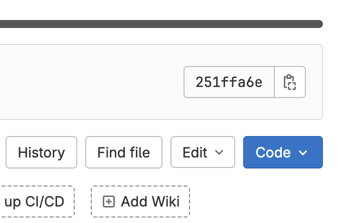
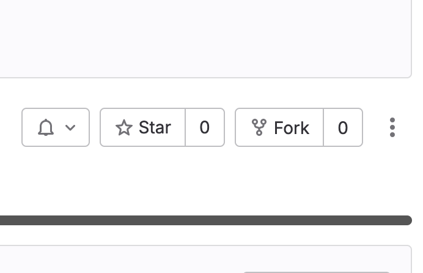

# Installation Guide

1. Click project link from readme file ([here](https://nw-syd-gitlab.cseunsw.tech/z5418045/testing_2041) if unbothered)
2. Click code button 
3. Depending on whether you wish to clone the project via ssh or https, click the respective link
4. git clone URL in terminal while in working directory
5. OR you can fork the project like so: (with forking, git does most of the work for you and it makes your own repository for it!) 